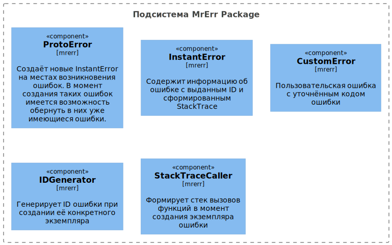

# Описание GoSysMess v0.15.0
Этот репозиторий содержит описание библиотеки GoSysMess.

## Статус библиотеки
Библиотека находится в стадии разработки.

## Описание библиотеки
Библиотека решает несколько основных задач:
- формирует пользовательские сообщения на различных языках, в том числе и сообщения об ошибках;
- предоставляет инструменты для более удобной обработки ошибок как пользовательских,
  так и программных согласующихся с Go подходом (более подробно см. ниже);
- предоставляет систему логирования сообщений и ошибок на основе `slog`;

## Подключение библиотеки
`go get -u github.com/mondegor/go-sysmess@v0.15.0`

## Установка библиотеки для её локальной разработки
- Выбрать рабочую директорию, где должна быть расположена библиотека
- `mkdir go-sysmess && cd go-sysmess` // создать и перейти в директорию проекта
- `git clone git@github.com:mondegor/go-sysmess.git .`
- `cp .env.dist .env`
- `mrcmd go-dev deps` // загрузка зависимостей проекта
- Для работы утилит `gofumpt`, `goimports`, `mockgen` необходимо в `.env` проверить
  значения переменных `GO_DEV_TOOLS_INSTALL_*` и запустить `mrcmd go-dev install-tools`

### Консольные команды используемые при разработке библиотеки

> Перед запуском консольных скриптов библиотеки необходимо скачать и установить утилиту Mrcmd.\
> Инструкция по её установке находится [здесь](https://github.com/mondegor/mrcmd#readme)

- `mrcmd go-dev help` // выводит список всех доступных go-dev команд;
- `mrcmd go-dev generate` // генерирует go файлы через встроенный механизм go:generate;
- `mrcmd go-dev gofumpt-fix` // исправляет форматирование кода (`gofumpt -l -w -extra ./`);
- `mrcmd go-dev goimports-fix` // исправляет imports, если это требуется (`goimports -d -local ${GO_DEV_IMPORTS_LOCAL_PREFIXES} ./`);
- `mrcmd golangci-lint check` // запускает линтеров для проверки кода (на основе `.golangci.yaml`);
- `mrcmd go-dev test` // запускает тесты библиотеки;
- `mrcmd go-dev test-report` // запускает тесты библиотеки с формированием отчёта о покрытии кода (`test-coverage-full.html`);
- `mrcmd plantuml build-all` // генерирует файлы изображений из `.puml` [подробнее](https://github.com/mondegor/mrcmd-plugins/blob/master/plantuml/README.md#%D1%80%D0%B0%D0%B1%D0%BE%D1%82%D0%B0-%D1%81-%D0%B4%D0%BE%D0%BA%D1%83%D0%BC%D0%B5%D0%BD%D1%82%D0%B0%D1%86%D0%B8%D0%B5%D0%B9-%D0%BF%D1%80%D0%BE%D0%B5%D0%BA%D1%82%D0%B0-markdown--plantuml);

#### Короткий вариант выше приведённых команд (Makefile)
- `make deps` // аналог `mrcmd go-dev deps`
- `make generate` // аналог `mrcmd go-dev generate`
- `make lint` // аналог `mrcmd golangci-lint check`
- `make test` // аналог `mrcmd go-dev test`
- `make test-report` // аналог `mrcmd go-dev test-report`
- `make plantuml` // аналог `mrcmd plantuml build-all`

> Чтобы расширить список команд, необходимо создать Makefile.mk и добавить
> туда дополнительные команды, все они будут добавлены в единый список команд make утилиты.

## Обработка ошибок. Общие сведения
### Выделяются три вида ошибок:
- Пользовательские ошибки (user) - все те ошибки, которые должен исправить сам пользователь
  (примеры: недопустимый ввод данных; обращение к несуществующему ресурсу);
- Системные (system) - происходящие в системе и независящие от программы (примеры: отсутствует
  соединение с БД или с каким либо внешним API; отсутствие прав на запись файлов и т.д.);
- Программные (internal) - любые другие ошибки, допущенные разработчиками, или ошибки, которые
  не были классифицированы предыдущими видами (примеры: обращение к нулевому указателю;
  выход из диапазона значений массива; создание файла в несуществующей папке);

### Действия при обработке пользовательской ошибки:
- понятно объяснить причину возникновения;
- предложить варианты действий;
- возможно, превратить ошибку в пользовательский сценарий (например, если логин уже существует,
  то сгенерить похожие варианты и предложить пользователю выбрать один из них);

### Действия при обработке системной ошибки:
- понятно объяснить причину возникновения;
- предложить варианты действий, если возможно;
- сообщить, с чем обратиться в поддержку;
- отобразить уникальный код ошибки, под которым система предварительно записала эту ошибку в логи;
- узнавать об ошибках автоматически, а не от пользователя (т.к. не все пользователи обращаются
  в поддержку, да и оперативное исправление ошибок увеличивает лояльность пользователей);

### Действия при обработке программной ошибки:
- в заголовке всегда пишется фраза типа "Internal error";
- сообщить, с чем обратиться в поддержку;
- показать подробности, если это безопасно;
- отобразить уникальный код ошибки, под которым система предварительно записала эту ошибку в логи;
- узнавать об ошибках автоматически, а не от пользователя;

### Важные замечания:
- К какому виду отнести ту или иную ошибку могут только разработчики, помочь им в этом могут QA специалисты;
- Обработка ошибок - это тоже бизнес логика, поэтому её также нужно продумывать;
- Ошибка является интерфейсом вызова функции, поэтому её необходимо обрабатывать;

### Сценарии работы с ошибками:
- user - понимает что случилось и как это исправить;
- developer - исследует возникшую проблему и выявляет её причины;
- team lead - отслеживает работоспособность системы, выявляет новые ошибки,
  принесённые релизом; оценивает влияние ошибок на пользователей;

## Архитектура обработки ошибок
Внутренний архитектурный слой не должен влиять на поведение верхнего, поэтому ошибки должны быть
частью интерфейса каждого слоя. Определение типов ошибок должны быть в том же слое где возникает
данная ошибка. Причём для каждой ошибки должен быть указан её вид: user, system, internal.

Основная обработка (перехват) ошибок должна происходить в слое UseCase, только он знает как
именно обрабатывать ошибки поступивших из других слоёв, а также правильно определить нужный
вид ошибки. Конкретный слой, обрабатывая ошибку, должен создать объект с ошибкой, определённую
в этом слое, а если этот слой обрабатывает уже перехваченную ошибку, то он должен вложить
её в созданную им ошибку, для того, чтобы внешний перехватчик смог обработать всю цепочку
ошибок и выполнить необходимые действия для каждого вида ошибок.

Чтобы избавить код от текстов пользовательских ошибок, а также одновременно решить проблему
локализации, все тексты пользовательских ошибок необходимо хранить отдельно.

## Пример архитектуры обработки ошибок

### Подсистема формирования ошибок
- [ProtoError](https://github.com/mondegor/go-sysmess/blob/master/mrerrors/proto_error.go);
- [InstantError](https://github.com/mondegor/go-sysmess/blob/master/mrerrors/instant_error.go);
- [CustomError](https://github.com/mondegor/go-sysmess/blob/master/mrerr/custom_error.go);
- [GenerateErrorID](https://github.com/mondegor/go-sysmess/blob/master/mrerr/generate/instance_id.go);
- [ErrorStackTrace](https://github.com/mondegor/go-sysmess/blob/master/mrerr/stacktrace/caller.go);
- [Примеры базового пакета](https://github.com/mondegor/go-sysmess/tree/master/examples/mrerrors);
- [Примеры расширенного пакета](https://github.com/mondegor/go-sysmess/tree/master/examples/mrerr);

### Подсистема обработки ошибок
- [Создание и инициализация ошибок опциями по умолчанию](https://github.com/mondegor/go-sysmess/blob/master/mrerr/error.go); 
- [ErrorHandler](https://github.com/mondegor/go-sysmess/blob/master/mrerr/error_handler.go);
- Библиотека готовых типов ошибок:
  - [Внутренние ошибки](https://github.com/mondegor/go-sysmess/blob/master/mrerr/mr/errors_internal.go);
  - [Инфраструктурные ошибки](https://github.com/mondegor/go-sysmess/blob/master/mrerr/mr/errors_storage.go);
  - [Ошибки бизнес логики](https://github.com/mondegor/go-sysmess/blob/master/mrerr/mr/errors_usecase.go);
  - [Http ошибки](https://github.com/mondegor/go-sysmess/blob/master/mrerr/mr/errors_http.go);
- Врапперы ошибок:
  - [Для инфраструктурного слоя](https://github.com/mondegor/go-sysmess/blob/master/mrerr/mr/wrapper_storage.go);
  - [Для слоя бизнес логики](https://github.com/mondegor/go-sysmess/blob/master/mrerr/mr/wrapper_usecase.go);

### Сервис использующий обработку ошибок

### Верхнеуровневая архитектура системы обработки ошибок
